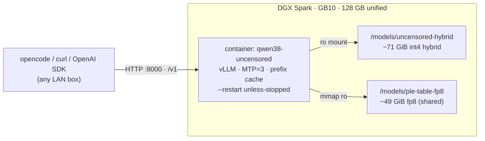

<div align="center">

# Qwen3.8‑Flash‑Next — Uncensored, always‑on serve

**Uncensored [Qwen3.8‑Flash‑Next](https://huggingface.co/bidhata/Qwen3.8-Flash-Next-AutoRound-Uncensored) on a single DGX Spark (GB10), served with vLLM.**
OpenAI‑compatible API on every interface · auto‑restart after reboot · ~135 tok/s aggregate over 8 streams.


-f59e0b?style=flat-square)

*Author:* **Krishnendu Paul** · [me@krishnendu.com](mailto:me@krishnendu.com) · <https://krishnendu.com>

</div>

---

## Contents

- [At a glance](#at-a-glance)
- [How it fits together](#how-it-fits-together)
- [Requirements](#requirements)
- [Install](#install)
- [Use from the LAN (opencode)](#use-from-the-lan-opencode)
- [Configuration](#configuration)
- [Benchmarks](#benchmarks)
- [500 k context (YaRN)](#500k-context-yarn)
- [Verify &amp; operate](#verify--operate)
- [Uninstall](#uninstall)
- [Files](#files)
- [Contact](#contact)

---

## At a glance

| | |
|---|---|
| **Model** | [`bidhata/Qwen3.8-Flash-Next-AutoRound-Uncensored`](https://huggingface.co/bidhata/Qwen3.8-Flash-Next-AutoRound-Uncensored) — gated, ~71 GiB, int4/int8/fp8 hybrid (same recipe as the stock model, drop‑in for its serving stack) |
| **PLE table** | `Saren/Qwen3.8-Flash-Next-ple-table-fp8` — ~49 GiB, mmapped from local NVMe, **reused not re‑downloaded** |
| **Serving stack** | [`Saren-Arterius/qwen3.8-Flash-DGX-AutoRound`](https://github.com/Saren-Arterius/qwen3.8-Flash-DGX-AutoRound) — vLLM + PLE mmap + MTP speculative decoding + prefix caching |
| **Container** | `qwen38-uncensored` · `--restart unless-stopped` · bind `0.0.0.0:8000` · model id `qwen` · Docker healthcheck |
| **Measured here** | ~37 tok/s fresh decode · ~44 tok/s cached · ~135 tok/s aggregate (8 streams) · TTFT ~0.2–0.9 s · 500 k context working (needle retrieved exactly at 320 k tokens) |

> [!NOTE]
> **One model at a time per box.** Install stops the stock `qwen38-flash` container — two residents exceed the 128 GiB unified pool and fight for `:8000`.

---

## How it fits together



`install.sh` builds the image once, mounts the weights and the shared PLE table read‑only, and hands the container a long vLLM command (piecewise CUDA graphs, chunked prefill, MTP spec decode, tool + reasoning parsers). The restart policy plus `docker` enabled at boot bring it all back after a reboot.

---

## Requirements

- NVIDIA **DGX Spark / GB10**, 128 GB unified memory, **aarch64**
- **Docker** with the NVIDIA container runtime · `git` · `curl` · `ip`
- `hf` CLI logged in — the weights repo is gated:
  ```bash
  pip install -U 'huggingface_hub[hf_transfer,cli]' && hf auth login
  ```
- **~80 GiB free** at `/models` for the weights (`/models/uncensored-hybrid`)

---

## Install

```bash
cd /root/qwen-serve
./install.sh                 # full install + start on :8000  (~5 min boot)
PORT=8001 ./install.sh       # serve on a different host port
FORCE=1 ./install.sh         # reinstall even if a healthy container is already up
```

**What it does**

| # | Step |
|---|---|
| 1 | **Preflight** — docker daemon, NVIDIA runtime visible to docker, `hf` auth against the gated repo, `aarch64`, ~80 GiB free. |
| 2 | **Short‑circuit** — if `qwen38-uncensored` is already running *and* answering on `:$PORT`, exit `0` (override with `FORCE=1`). |
| 3 | Stop the stock `qwen38-flash` container if present. |
| 4 | Build the `qwen38-flash-dgx` image from the upstream recipe (skipped if present; pin the source with `STACK_REF`). |
| 5 | Download the weights to `/models/uncensored-hybrid` and the PLE table to `/models/ple-table-fp8` (resumable, skipped if present). |
| 6 | `systemctl enable docker` so the daemon — and the restart policy — survive a reboot. Best effort; auto‑`sudo` only when not root. |
| 7 | Start `qwen38-uncensored` with `--restart unless-stopped`, a Docker healthcheck, bound to `0.0.0.0:$PORT` (model id `qwen`, MTP=3, prefix caching on, `262144` context). |
| 8 | Wait for the API, run a smoke completion, print local + LAN URLs. **On failure:** dump the last 40 log lines and remove the half‑started container. |

> [!TIP]
> It comes back automatically after a system reboot — restart policy + `docker` enabled at boot. Re‑running `./install.sh` on a healthy box is now a no‑op.

---

## Use from the LAN (opencode)

On each other box, merge into `~/.config/opencode/opencode.json`:

```json
{
  "$schema": "https://opencode.ai/config.json",
  "provider": {
    "dgx-spark": {
      "npm": "@ai-sdk/openai-compatible",
      "name": "DGX Spark (LAN)",
      "options": { "baseURL": "http://10.1.10.41:8000/v1" },
      "models": {
        "qwen": {
          "name": "Qwen3.8-Flash-Next Uncensored (int4 hybrid)",
          "limit": { "context": 500000, "output": 32768 }
        }
      }
    }
  }
}
```

Replace `10.1.10.41` with this box's LAN IP if it changes, then `/models` in opencode → `dgx-spark/qwen`. No API key needed (vLLM has no auth). No client‑side tuning for throughput — concurrent requests batch server‑side automatically.

---

## Configuration

Every knob is an environment variable read by `install.sh`:

| Var | Default | Purpose |
|---|---|---|
| `PORT` | `8000` | host port to publish |
| `CTX` | `262144` | `--max-model-len` |
| `SEQS` | `8` | `--max-num-seqs` |
| `KV_BYTES` | `20g` | `--kv-cache-memory-bytes` |
| `MTP` | `3` | MTP speculative tokens |
| `FORCE` | `0` | `1` = reinstall / rebuild even if a healthy container is up |
| `EXTRA` | *(empty)* | args appended **verbatim** to the vLLM command — last flag wins, so it overrides earlier ones |
| `VLLM_ALLOW_LONG_MAX_MODEL_LEN` | `0` | pass `1` for a context beyond the checkpoint default (see YaRN) |
| `STACK_REF` | *(empty)* | git commit / tag / branch of the serving stack to build — reproducible images |
| `MODEL_ID` · `TABLE_ID` | see script | Hugging Face repo ids |
| `MODEL_DIR` · `TABLE_DIR` | `/models/uncensored-hybrid` · `/models/ple-table-fp8` | local weight paths |
| `NAME` · `IMAGE` · `STOCK_NAME` | `qwen38-uncensored` · `qwen38-flash-dgx` · `qwen38-flash` | container + image names |

---

## Benchmarks

Measured on **1× DGX Spark (GB10)**. Config: MTP=3, prefix caching on, `SEQS=8`, KV `20g`, 500 k YaRN context unless noted.
Harness: upstream `bench/decode_bench.py` (W1 = fresh 1000‑token decode, W2 = ~8 k prefix hit + 256 tokens) and `agg_bench.py` (8×256 unique prompts).

| Workload | Result |
|---|---|
| Fresh decode, single stream (W1) | **37.5 tok/s** median · TTFT ~0.2 s |
| Prefix‑cache hit (W2) | **44.2 tok/s** median · TTFT ~0.9 s |
| Aggregate, 8 concurrent streams | **134.6 tok/s** (2048 tokens / 15.2 s wall) |
| Spec decode (MTP=3) | ~2.5–2.9 tok/step · 50–65 % accept |
| Long context (YaRN) | needle exact at **320,089 tokens** · ~2800 tok/s prefill |
| 262 k stock baseline (reference) | W1 25.2 tok/s · W2 45.5 tok/s |

> [!NOTE]
> Single‑run numbers swing >10 % on this stack — medians of 3 runs reported.

---

## 500 k context (YaRN)

`install.sh` now forwards `EXTRA` and `VLLM_ALLOW_LONG_MAX_MODEL_LEN`, so enabling YaRN is a single command — no script patch:

```bash
CTX=500000 VLLM_ALLOW_LONG_MAX_MODEL_LEN=1 \
EXTRA='--hf-overrides {"text_config": {"rope_parameters": {"mrope_interleaved": true, "mrope_section": [11, 11, 10], "rope_type": "yarn", "rope_theta": 10000000, "partial_rotary_factor": 0.25, "factor": 4.0, "original_max_position_embeddings": 262144}}} --speculative-config {"method":"mtp","num_speculative_tokens":3,"max_model_len":500000}' \
./install.sh
```

Validated on the stock checkpoint on this box: needle exact at 320 k tokens, same‑or‑better tok/s, no OOM. Same format, so it applies here identically. Bump the opencode `limit.context` to `500000` when enabled.

> [!WARNING]
> Do not go to 800 k+ — documented early‑OOM on this stack.

---

## Verify &amp; operate

```bash
curl http://localhost:8000/v1/models            # model id: qwen
docker ps --filter name=qwen38-uncensored       # STATUS shows healthy / unhealthy
docker logs -f qwen38-uncensored                # boot / health
python3 agg_bench.py 8 256                       # aggregate tok/s, 8 streams
```

---

## Uninstall

```bash
./uninstall.sh              # stop + remove container (keeps image + weights)
./uninstall.sh --image      # also remove image  (shared with the stock server!)
./uninstall.sh --models     # also delete /models/uncensored-hybrid (~71 GiB)
```

The shared PLE table is never touched.

---

## Files

| File | Purpose |
|---|---|
| `install.sh` | full install + always‑on serve (idempotent; `FORCE`, `EXTRA`, `STACK_REF` knobs) |
| `uninstall.sh` | teardown (`--image`, `--models` flags) |
| `agg_bench.py` | N‑stream aggregate tok/s harness |
| `README.md` | this file |

---

## Contact

**Krishnendu Paul** — [me@krishnendu.com](mailto:me@krishnendu.com) — <https://krishnendu.com>
